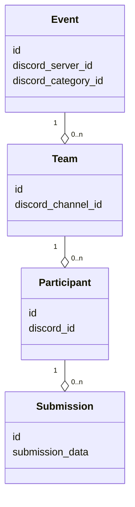
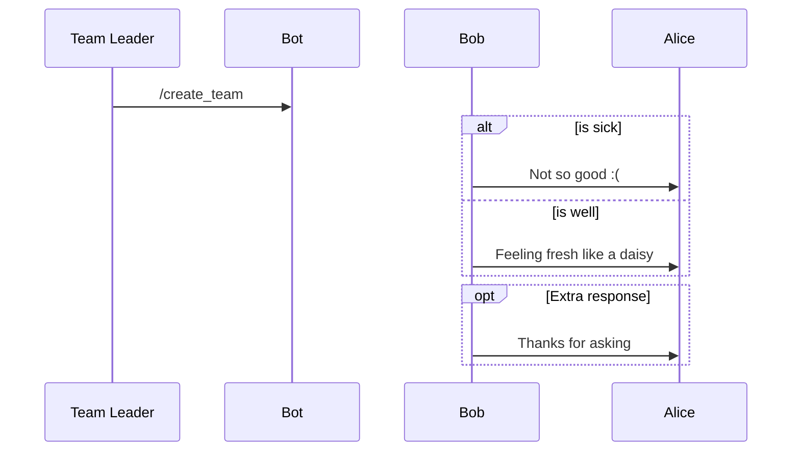

Sample Database Schema

```mermaid
classDiagram
  direction TB

  class Event {
    id
    discord_server_id
    discord_category_id
  }

  class Participant {
    id
    discord_id
  }

  class Team {
    id
    discord_channel_id
  }

  class Submission {
    id
    submission_data
  }

  Event "1" --o "0..n" Team
  Team "1" --o "0..n" Participant
  Participant "1" --o "0..n" Submission
```

## Usage diagram

```mermaid
sequenceDiagram
    Team Leader ->> Bot: /create_team
    alt is sick
        Bob->>Alice: Not so good :(
    else is well
        Bob->>Alice: Feeling fresh like a daisy
    end
    opt Extra response
        Bob->>Alice: Thanks for asking
    end
```